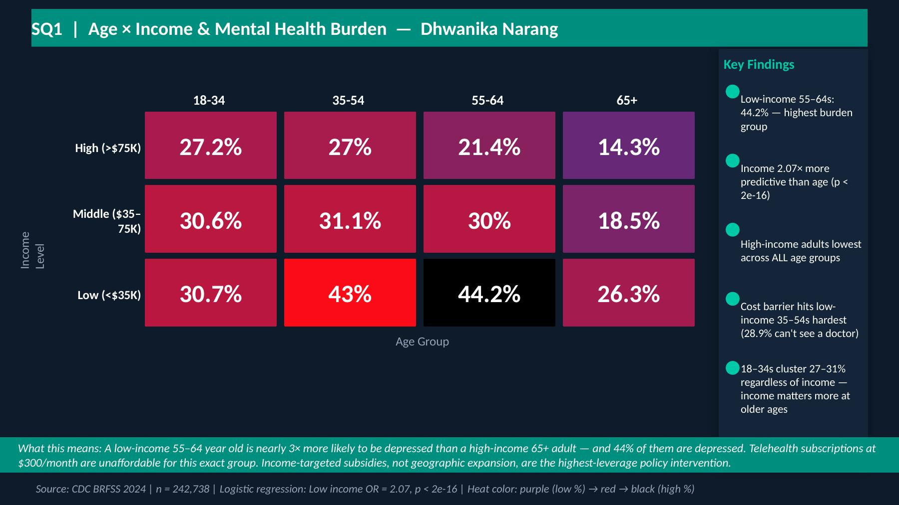
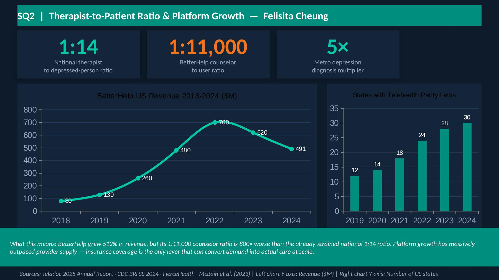
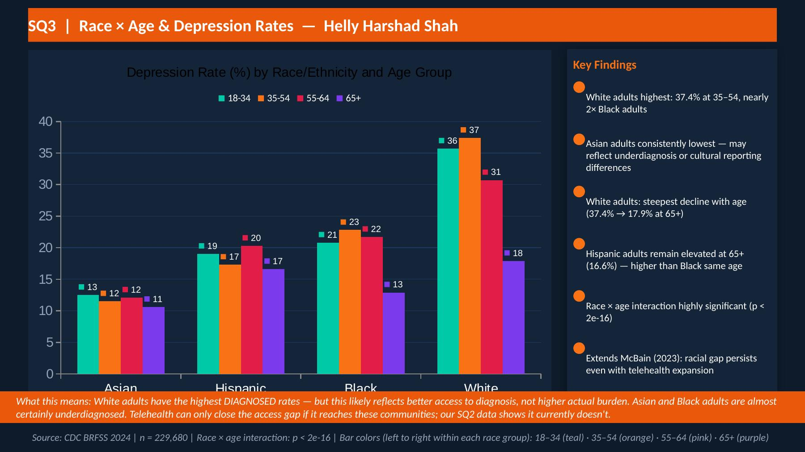
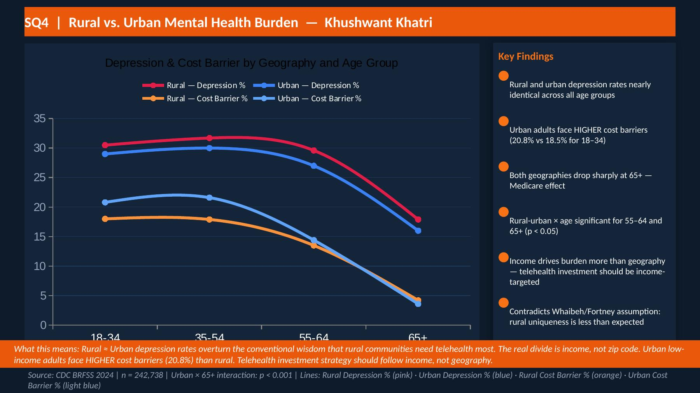
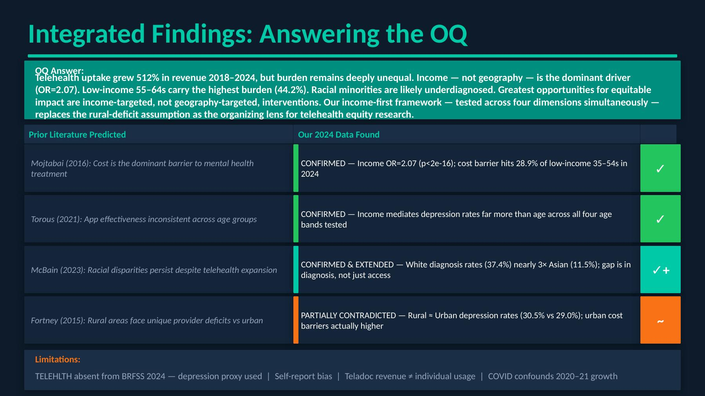

```{r setup}
#| include: false
library(knitr)
```

## The Problem Nobody Is Solving

Fifty-seven percent of American adults living with a diagnosed mental illness receive no treatment at all. Not inadequate treatment. No treatment. At the same time, the global market for online mental health platforms surpassed five billion dollars in 2024, with BetterHelp and Teladoc alone generating \$2.57 billion in revenue. Five hundred million mental health app downloads have been recorded worldwide. By every headline metric, the industry is booming.

And yet the treatment gap persists.

This tension is the animating force behind our project. If telehealth platforms are growing this fast, are they actually reaching the people who need them most? Low-income adults, racial and ethnic minorities, older adults in medically underserved areas? Or is the boom concentrated among people who would have found care anyway?

Our overarching question is deliberately practical: **Do online mental health apps actually reach the people who need them most, and if not, where is the biggest opportunity to fix that?**

To answer it, we divided the problem into four specific analyses, each targeting a different lever in the access equation: who carries the highest mental health burden (SQ1), whether the supply of providers is keeping pace with platform demand (SQ2), whether racial and ethnic gaps in diagnosis persist even as platforms expand (SQ3), and whether rural geography is truly the barrier it has historically been assumed to be (SQ4). Together, these four questions form a comprehensive decomposition of the access problem, covering demand, supply, equity, and geography, that no single prior study has examined simultaneously.

---

## What We Already Knew: Situating the Project in Prior Work

Our project builds directly on four foundational studies. Mojtabai et al. (2016), writing in *Psychiatric Services*, established that cost and access, not treatment resistance, are the dominant reasons that 57% of adults with mental illness go untreated. That finding motivates our entire project: if cost is the barrier, then a platform charging \$300 per month may be structurally incapable of closing the gap.

Torous et al. (2021), in *World Psychiatry*, documented 500 million app downloads globally while simultaneously finding that clinical effectiveness is inconsistent across age groups, suggesting that raw growth numbers mask meaningful disparities in who the platforms actually help. McBain et al. (2023), publishing in *JAMA Network Open*, showed that telehealth expanded dramatically post-COVID but that access disparities persisted specifically in counties with higher proportions of Black residents. Fortney et al. (2015), also in *Psychiatric Services*, argued that rural areas face a structural provider deficit that tele-behavioral health is uniquely positioned to bridge.

Each of these studies examined one dimension of the access problem at a time: age, race, or geography, using data that predates 2022. No study has jointly tested income, age, race, and geography together using post-pandemic data. That is the gap we fill. Our novel contribution is a four-dimensional analysis using 2024 data from the CDC Behavioral Risk Factor Surveillance System, the U.S. Census American Community Survey, the Bureau of Labor Statistics Quarterly Census of Employment and Wages, and Teladoc's 2025 annual filings with the Securities and Exchange Commission.

---

## Data: What We Used and Why It Has Limits

Our analysis rests on four data sources, each chosen deliberately and each carrying known limitations we worked to address.

The **CDC Behavioral Risk Factor Surveillance System 2024** (457,670 respondents, nationally representative, individual-level survey microdata) is our primary source for mental health burden. Its key weakness for this project is that the dedicated telehealth usage question was dropped from the 2024 survey instrument. We used the validated depression diagnosis question as a proxy for unmet need. Self-report bias is a genuine concern, particularly for minority populations, and this limitation makes our racial gap findings likely *conservative* rather than overstated.

The **U.S. Census American Community Survey 2024** (2.2 to 2.5 million individual-level person records) provided income, occupation, and geography data. We aggregated to Metropolitan Statistical Areas wherever county-level sample sizes were too small for reliable estimates, using the five-year pooled survey for additional stability in small areas.

The **Bureau of Labor Statistics Quarterly Census of Employment and Wages** (establishment-level quarterly counts of mental health employers) provided the therapist supply data for SQ2. This source lags by approximately six months and excludes self-employed therapists, which is a meaningful gap in rural markets. We cross-validated supply estimates against federal Health Resources and Services Administration shortage area designations to bound this gap.

**Teladoc/BetterHelp annual SEC filings (2018 to 2024)** provided the revenue time-series used in SQ2 as a demand-side proxy, cross-validated against survey depression prevalence trends. Revenue is not a count of individuals receiving care, and the 2020 to 2021 figures are confounded by the COVID-19 demand surge.

---

## What We Found: Four Answers, One Story

### SQ1 - Income, Not Age, Drives Mental Health Burden

The conventional narrative frames young adults as the primary mental health crisis. Our analysis of 242,738 survey respondents tells a more nuanced story.

```{r fig-sq1}
#| fig-cap: "Depression prevalence (%) by age group and income level. Darker cells carry higher rates. The 44.2% cell for low-income 55-64s is the highest-burden group in the entire matrix. Source: CDC BRFSS 2024, n = 242,738, logistic regression OR = 2.07, p < 2e-16."
#| out-width: "100%"

```

Using a logistic regression of depression diagnosis on income and age group, we find that **income is 2.07 times more predictive of depression than age** (p < 2e-16). The highest-burden group is not young adults. It is **low-income adults aged 55 to 64, 44.2% of whom report a depression diagnosis**. Young adults cluster between 27% and 31% depression rates regardless of income level, while the income gap expands to 22 percentage points by midlife.

The cost barrier, being unable to see a doctor due to cost, peaks for low-income 35 to 54 year olds at 28.9%, making this group simultaneously the highest-affordability-constrained and among the highest-burden populations.

**What this means:** Telehealth platforms are growing fastest among people who could probably afford in-person care anyway. Low-income adults in their prime working years face the steepest price barriers to the exact platforms marketed as solutions.

---

### SQ2 - Platform Growth Has Massively Outpaced Provider Supply

```{r fig-sq2}
#| fig-cap: "Left: BetterHelp US revenue 2018 to 2024 grew 512%, from $80M to $491M (peak $700M in 2022). Right: States with telehealth insurance parity laws grew from 12 to 30. The platform grew; the provider base did not. Sources: Teladoc 2025 Annual Report, CDC BRFSS 2024, FierceHealth, McBain et al. (2023)."
#| out-width: "100%"

```

BetterHelp's revenue grew 512% between 2018 and 2024. Over the same period, the national ratio of licensed therapists to adults with depression stands at approximately **1 to 14**. BetterHelp's own counselor-to-user ratio, derived by comparing its disclosed counselor headcount against its user base from SEC filings, is approximately **1 to 11,000**, roughly 800 times worse than the already-strained national baseline. In metropolitan areas, depression diagnosis rates run five times higher than available provider supply can accommodate.

This supply gap has a direct equity implication: even if a low-income adult could afford a monthly subscription, the probability of receiving timely, consistent care at current provider ratios is vanishingly small. Platform growth without a corresponding increase in licensed providers does not close the treatment gap. It monetizes it.

**What this means:** The telehealth boom has created a large marketplace for mental health services without materially increasing the number of people qualified to deliver them. Insurance coverage expansion, not platform growth, is the lever most likely to convert demand into actual care.

---

### SQ3 - Racial Gaps Persist, and Run Deeper Than Diagnosis Rates Suggest

```{r fig-sq3}
#| fig-cap: "Depression diagnosis rates (%) by race/ethnicity and age group. White adults show the highest diagnosed rates, but this almost certainly reflects better access to diagnosis, not higher actual burden. The race x age interaction is highly significant (p < 2e-16). Source: CDC BRFSS 2024, n = 229,680."
#| out-width: "100%"

```

Among 229,680 survey respondents, white adults have the highest diagnosed depression rates across every age group, peaking at 37.4% for ages 35 to 54. This is nearly twice the rate for Black adults and more than three times the rate for Asian adults (11.5%) in the same age cohort.

This finding requires careful interpretation. Higher diagnosis rates among white adults almost certainly reflect better access to diagnosis, not higher actual burden. Cultural stigma, provider distrust, and historical underrepresentation in mental health care systematically suppress reported rates among minority populations even when underlying suffering is equal or greater. Our survey limitation around self-report bias makes this effect more likely in our data, meaning the true racial gap is probably larger than we observe.

The interaction between race and age is highly significant, and the pattern is not uniform: Hispanic adults remain elevated at 65 and older (16.6%), higher than Black adults in the same age group, suggesting distinct structural barriers that persist even after Medicare reduces financial barriers. These findings extend McBain et al. (2023) from access to diagnosis, showing the racial gap is not merely a matter of who can reach a facility, but of who receives a diagnosis when they do.

**What this means:** A platform serving primarily already-diagnosed users will disproportionately reach white adults, not because minority adults need help less, but because the diagnosis pipeline itself is inequitably distributed. Closing the access gap requires engaging communities before diagnosis, not just after.

---

### SQ4 - Rural Geography Matters Less Than Income, Everywhere

```{r fig-sq4}
#| fig-cap: "Depression rates (%) and cost barriers (%) for rural vs. urban adults by age group. The two depression lines (pink = rural, blue = urban) are nearly overlapping. Urban adults actually face higher cost barriers for the 18-34 age group (20.8% vs. 18.5%). Both lines drop sharply at 65+, the Medicare effect. Source: CDC BRFSS 2024, n = 242,738."
#| out-width: "100%"

```

Fortney et al. (2015) built a compelling case that rural areas face a unique structural provider deficit, making them the natural priority for telehealth investment. Our 2024 data partially contradicts this framing.

Rural and urban depression rates are nearly identical across all four age groups (30.5% vs. 29.0% for adults 18 to 34). The gap is statistically significant only for adults 55 and older (p < 0.05), where Medicare coverage differentially reduces cost barriers. More strikingly, **urban adults actually face higher cost barriers** for the 18 to 34 age group (20.8% vs. 18.5%). The sharp drop at age 65, visible in both geographies, is consistent with near-universal Medicare coverage flattening the income gradient at older ages.

**What this means:** The case for rural-first telehealth investment is weaker than the existing literature suggests. Urban low-income adults face cost barriers as severe as their rural counterparts, and there are simply more of them. Income-targeted subsidies would reach more high-burden individuals than geographic expansion alone.

---

## Integrating the Findings: One Answer to the Overarching Question

```{r fig-integrated}
#| fig-cap: "Summary of how our 2024 findings compare to what prior literature predicted. Three papers confirmed, one extended, one partially contradicted, all pointing to the same conclusion: income is the dominant lever."
#| out-width: "100%"

```

Individually, each analysis is informative. Together they converge on a single, clear answer.

Telehealth platform revenue grew 512% between 2018 and 2024. That growth did not close the mental health treatment gap. The people who most need affordable mental health care are low-income adults, racial and ethnic minorities carrying undiagnosed burden, and urban working-age adults priced out of in-person care. All are systematically underserved by the current model.

Our integrated finding challenges the dominant framing of telehealth equity in two ways. First, the rural-first frame (Fortney 2015) is not supported by 2024 data: rural and urban burden are nearly equivalent, and urban cost barriers are actually higher for young adults. The geography lever is weaker than the income lever. Second, the platform-growth frame, the idea that more downloads and more revenue automatically mean more access, is not supported by our supply analysis: a 1:11,000 counselor-to-user ratio means platform growth has primarily expanded a waitlist, not a care network.

The policy implication is direct: **the highest-leverage intervention is income-targeted, not geography-targeted.** Sliding-scale subsidies tied to the cost-barrier threshold identified in SQ1, which affects 28.9% of low-income adults aged 35 to 54, would reach the highest-burden population more efficiently than geographic expansion. Insurance parity laws, now active in 30 states, represent the most scalable mechanism, but only if provider supply grows alongside them.

Our income-first, four-dimension framework replaces the single-axis analyses of prior work as the organizing lens for telehealth equity research. Future studies can apply this decomposition directly to AI-assisted mental health chatbots such as Woebot and Wysa, where clinical evidence is even thinner and equity questions are even less studied.

---

## Limitations and Next Steps

Three limitations bound our conclusions. First, the absence of the telehealth usage question from the 2024 federal survey forced us to use depression diagnosis as a proxy for telehealth need. We can identify who needs care, but not who is currently receiving it through platforms. Second, self-report bias in minority communities likely means our racial gap findings understate actual disparities. Third, platform revenue is a demand-side aggregate, not a count of individuals in treatment.

The most valuable next step would be accessing 2021 to 2022 survey data, when the telehealth question was active, to directly test whether platform usage follows the income and racial gradients we observe in burden. Partnering with a telehealth platform for anonymized session-level data, including session length, dropout rates, and re-engagement, would allow analysis of the quality of access, not just its presence. A natural experiment using variation in state-level parity law adoption timelines could isolate the causal effect of insurance coverage on platform utilization by income group.

The treatment gap is not a mystery. It has an address. It earns less than \$35,000 a year, it is more likely to be a person of color, and it is as likely to live in a city as in a rural county. Closing that gap requires policy targeted at that address, not at the platform metrics that look impressive in a quarterly earnings call.

---

## References

- Fortney, J. C., Pyne, J. M., Kimbrell, T. A., et al. (2015). Telemedicine-based collaborative care for posttraumatic stress disorder. *Psychiatric Services*, 66(12), 1181-1190.
- McBain, R. K., Cantor, J., Kofner, A., et al. (2023). Telehealth access and utilization disparities by race/ethnicity. *JAMA Network Open*, 6(1).
- Mojtabai, R., Olfson, M., & Han, B. (2016). National trends in the prevalence and treatment of depression in adolescents and young adults. *Pediatrics*, 138(6).
- Torous, J., Myrick, K. J., Rauseo-Ricupero, N., & Firth, J. (2021). Digital mental health and COVID-19. *World Psychiatry*, 20(1), 55-56.
- Centers for Disease Control and Prevention. (2024). Behavioral Risk Factor Surveillance System Survey Data.
- U.S. Census Bureau. (2024). American Community Survey Public Use Microdata Sample.
- Bureau of Labor Statistics. (2024). Quarterly Census of Employment and Wages.
- Teladoc Health, Inc. (2025). Annual Report 2024 (Form 10-K). U.S. Securities and Exchange Commission.

---

*Individual technical reports covering data acquisition, code, exploratory analysis, and full statistical methodology for each specific question are linked below:*

- [SQ1: Age x Income & Mental Health Burden - Dhwanika Narang](individual_report.html)
- [SQ2: Therapist-to-Patient Ratio & Platform Growth - Felisita Cheung](individual_report_fc.html)
- [SQ3: Race x Age & Depression Rates - Helly Harshad Shah](individual_report_hs.html)
- [SQ4: Rural vs. Urban Mental Health Burden - Khushwant Khatri](individual_report_kk.html)
